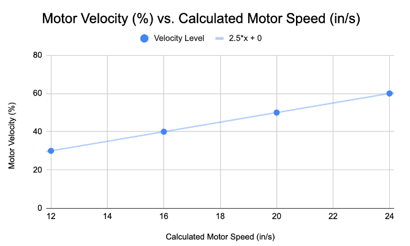

### The goal of this project is to determine a relationship between the motor velocity (%) and the calculated motor speed (in/s). The calculated motor speed is based on three timed trials for traveling 120 in. for each of the following motor velocities: 30%, 40%, 50%, and 60%.

