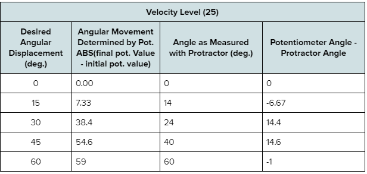

### The goal of this project is to control the lift arm using the potentiometer, which is used to measure angular movement. For the angular displacement determined by the potentiometer values, the formula                |final potentiometer value - initial potentiometer value| should be used. For measuring the actual angle, a protractor (or other angle-measuring tool) should be used. The lift motor is programmed to move the lift arm to the desired angle (there may be some error due to angular momentum).

