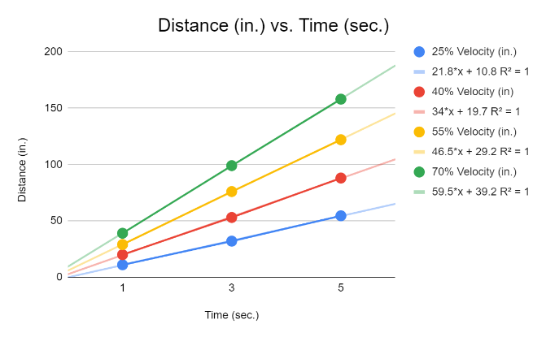
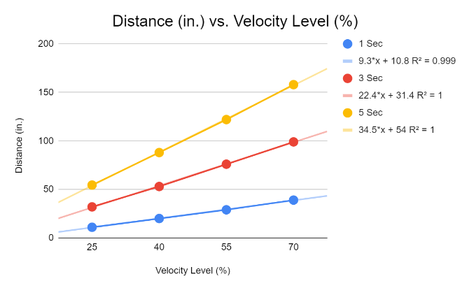

### The goal of the project is to identify the relationship between motor velocity levels (%) and the distance (in.) traveled. The robot was run at 25%, 45%, 55%, and 70% velocity levels for 1, 3, and 5 seconds

#### In addition to the motor velocity, wait states is also modified.

